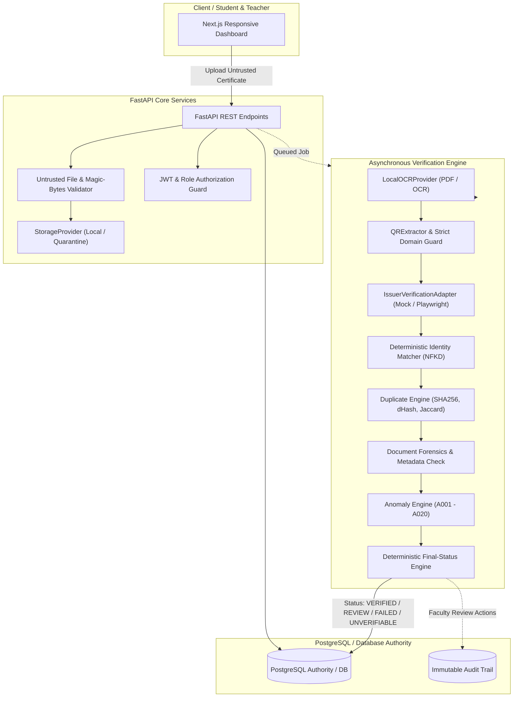

# CertificateGuard

> **Evidence-Based Certificate Verification & Anomaly Detection Platform**  
> *« AI and automation provide evidence. The issuer and teacher provide trust. »*

CertificateGuard is a robust, production-ready certificate verification platform built for universities and educational institutions. It validates uploaded academic credentials through a combination of cryptographic hashing, deterministic OCR parsing, QR destination verification against approved registries, browser automation (Playwright), identity matching, duplicate detection, document forensics, and an explainable 20-rule anomaly engine.

Suspicious or unverifiable submissions are routed to faculty teachers with complete evidence cards, while maintaining an immutable, tamper-evident audit trail.

---

## Architecture Diagram



---

## Key Features

1. **Untrusted Input Security**: Every uploaded file is treated as hostile input:
   - Magic byte header inspection (`%PDF-`, `\x89PNG`, `\xff\xd8\xff`)
   - MIME and extension validation
   - Immediate cryptographic SHA-256 fingerprinting
   - Rejection and quarantine of malformed files without crashing worker processes
   - Continuous file integrity checks: if the stored file changes on disk (`OLD_HASH != CURRENT_HASH`), a `CRITICAL` anomaly (`A013: FILE_CHANGED_AFTER_VERIFICATION`) is raised and previous results are revoked.
2. **Deterministic Certificate Extraction**: Regex-anchored semantic extractor for Certificate ID, Recipient Name, Course/Degree, Issuer, and Issue/Expiry Dates.
3. **QR Domain Trust Validation**: Strict origin validation against the official Issuer Registry. Rejects subdomain spoofing and domain suffix injection (e.g. `example.edu.fake.io` is strictly rejected).
4. **Isolated Verification Adapters**:
   - `MockIssuerAdapter`: Authoritative mock resolver for automated testing and zero-dependency local runs.
   - `PlaywrightIssuerAdapter`: Sandboxed browser automation for issuers with public portals but no API. Gracefully falls back to `UNAVAILABLE` rather than faking authenticity.
5. **Deterministic Identity Matching**: Unicode NFKD decomposition, whitespace collapse, case folding, and punctuation stripping. Accurately flags `RECIPIENT_MISMATCH` when certificate belongs to someone else.
6. **Multi-Mechanism Duplicate Detection**:
   - `EXACT_HASH`: SHA-256 collision detection.
   - `CERTIFICATE_ID`: Cross-student credential re-use prevention.
   - `PERCEPTUAL_SIMILARITY`: Visual layout difference hashing (dHash).
   - `OCR_SIMILARITY`: Jaccard token similarity across document text.
7. **Document Forensics**: Metadata inspection for graphic design software traces (Photoshop, Canva, GIMP), timestamp anomalies, and abnormal page dimensions.
8. **20-Rule Explainable Anomaly Engine (A001–A020)**: Every anomaly exposes its severity (`CRITICAL`, `HIGH`, `MEDIUM`, `LOW`), description, and underlying evidence.
9. **Faculty Review & Immutable Audit**: Teachers can `APPROVE`, `REJECT`, or `REQUEST_EVIDENCE` with mandatory justifications. All actions are logged to an append-only audit trail.

---

## Technology Stack

- **Frontend**: Next.js 14, React 18, TypeScript, Tailwind CSS, Lucide React
- **Backend**: Python 3.12+, FastAPI, Pydantic v2, SQLAlchemy 2.0 (Async), aiosqlite / asyncpg, Alembic
- **Testing**: Pytest, Pytest-Asyncio, HTTPX
- **Containerization**: Docker, Docker Compose

---

## Repository Structure

```
certificateguard/
├── backend/
│   ├── app/
│   │   ├── api/            # REST API endpoints (auth, submissions, issuers, audit, stats)
│   │   ├── anomaly/        # Anomaly engine and Rules A001-A020
│   │   ├── extraction/     # OCR, QR decoding, deterministic extractor
│   │   ├── models/         # SQLAlchemy 2.0 async database models
│   │   ├── schemas/        # Pydantic validation & serialization models
│   │   ├── security/       # File validation, magic bytes, bcrypt, JWT auth
│   │   ├── services/       # Async verification pipeline & report generator
│   │   ├── storage/        # StorageProvider abstraction & local filesystem provider
│   │   └── verification/   # Identity matcher, duplicate detector, Playwright adapter
│   ├── tests/              # Unit tests, integration tests, red-team test suite (16 attacks)
│   └── requirements.txt
├── frontend/               # Next.js responsive dashboard
│   ├── app/                # Pages: Dashboard, Submit, Submissions Detail, Issuers, Audit
│   ├── lib/                # API client with token & role management
│   └── types/              # TypeScript definitions
├── mock-issuer/            # Mock Issuer Verification Server (API + Web HTML portal)
├── test-fixtures/          # Synthetic PDF certificates (10 test cases)
├── docker-compose.yml      # Multi-container orchestration
├── .env.example            # Environment template
└── README.md
```

---

## Quickstart & Local Execution

### Prerequisites
- Python 3.12+ (or Docker)
- Node.js 18+ and npm

### 1. Run Backend & Mock Issuer (Locally)

```bash
# In project root:
cd certificateguard

# Run backend with local virtual environment:
backend\venv\Scripts\python -m uvicorn app.main:app --port 8000 --reload --app-dir backend

# In a second terminal, run the Mock Issuer server:
backend\venv\Scripts\python mock-issuer/main.py
```

### 2. Run Frontend Dashboard

```bash
cd frontend
npm run dev
```

Visit:
- **Frontend Dashboard**: [http://localhost:3000](http://localhost:3000)
- **Backend API Docs**: [http://localhost:8000/docs](http://localhost:8000/docs)
- **Mock Issuer Portal**: [http://localhost:8001/verify?id=CERT-1002](http://localhost:8001/verify?id=CERT-1002)

---

## Pre-Seeded Development Accounts

For instant local evaluation, CertificateGuard comes pre-seeded with fictional accounts:

| Role | Email | Password | Purpose |
|---|---|---|---|
| **TEACHER** | `teacher@example.com` | `password123` | Inspect review queue, view anomalies, approve/reject |
| **STUDENT** | `student@example.com` | `password123` | Upload certificates, view history, inspect results |
| **ADMIN** | `admin@example.com` | `password123` | Manage approved issuer registry, full audit access |

*Note: The navigation bar in the frontend includes an instant role switcher to seamlessly test each persona.*

---

## Running the Automated Test Suite

CertificateGuard includes 25 comprehensive tests across Unit, Integration, and Red-Team suites:

```bash
backend\venv\Scripts\pytest -v backend\tests
```

### Verified Red-Team Attack Test Cases (Section 36)

- **Attack 1**: Real certificate, wrong student &rarr; `REVIEW` (`RECIPIENT_MISMATCH`)
- **Attack 2**: Fake QR domain &rarr; `REVIEW` (`UNTRUSTED_QR_DOMAIN`)
- **Attack 3**: Valid QR, mismatched certificate ID &rarr; `REVIEW` (`A016: INCONSISTENCY`)
- **Attack 4**: Certificate ID exists but recipient differs &rarr; `REVIEW` (`A007`)
- **Attack 5**: Same certificate uploaded twice &rarr; `DUPLICATE` (`EXACT_HASH` / `CERTIFICATE_ID`)
- **Attack 6**: Same certificate visually modified &rarr; `OCR_SIMILARITY`
- **Attack 7**: Stored file changed on disk after verification &rarr; `CRITICAL` (`A013: FILE_CHANGED_AFTER_VERIFICATION`)
- **Attack 8**: Student attempts to set verification status directly &rarr; `403 Forbidden`
- **Attack 9**: Student requests another student's certificate &rarr; `403 Forbidden`
- **Attack 10**: Fake issuer domain &rarr; `UNTRUSTED`
- **Attack 11**: Malformed PDF byte corruption &rarr; `400 Bad Request` without crashing worker
- **Attack 12**: Oversized file (>15MB) &rarr; `400 Bad Request` rejected
- **Attack 13**: Issuer website unavailable &rarr; `UNVERIFIABLE` (Never falsely marks `VERIFIED`)
- **Attack 14**: Playwright selector failure / timeout &rarr; `UNAVAILABLE`
- **Attack 15**: Issuer returns different recipient &rarr; `RECIPIENT_MISMATCH`
- **Attack 16**: Client submits forged verification payload &rarr; Backend strictly ignores client verdict

---

## Docker Deployment

To launch the complete platform (PostgreSQL, Backend, Mock Issuer, Frontend) with one command:

```bash
docker compose up --build
```

---

## Cloud Deployment (Vercel + Render)

The platform is split across two free tiers: the **Next.js frontend on Vercel** and the **FastAPI backend + mock issuer on Render** (Docker, defined in `render.yaml`).

### 1. Backend on Render (~2 minutes)

1. Push this repository to GitHub.
2. Render Dashboard → **New + → Blueprint** → select the repository.
3. Render detects `render.yaml` and creates:
   - `certificateguard-backend` (FastAPI, health check `/health`)
   - `certificateguard-mock-issuer` (verification portal)
4. Optional persistence: create a free Neon/Supabase Postgres and set `DATABASE_URL` on the backend service (`postgresql+asyncpg://...`). Left unset, the service uses ephemeral SQLite — fine for demos, resets on restart.
5. Note the backend URL: `https://certificateguard-backend.onrender.com`

### 2. Frontend on Vercel (~1 minute)

```bash
cd frontend
npx vercel link
npx vercel env add NEXT_PUBLIC_API_URL production   # https://certificateguard-backend.onrender.com
npx vercel deploy --prod
```

Or connect the repository in the Vercel dashboard with the same environment variable.

### 3. Point backend at the frontend

Set `CORS_ORIGINS` on the Render backend service to the Vercel URL and redeploy.

> **Free-tier notes**: Render free instances spin down after inactivity (first request takes ~30s), uploads are stored on ephemeral disk (reset on instance restart), and Playwright browser automation is not installed in the container — the backend then falls back to the authoritative mock resolver, which is the designed graceful-degradation path.

---

## Known Limitations & Security Considerations

1. **Optical Character Recognition (OCR)**: In offline/zero-dependency environments, native PDF text stream extraction is used. For scanned bitmap images, installing system `tesseract-ocr` enhances recognition accuracy.
2. **Playwright Portals with CAPTCHA**: Third-party verification portals protected by Cloudflare Turnstile or reCAPTCHA will fail browser automation gracefully and route to `UNVERIFIABLE` / `MANUAL_REVIEW`, as automated bypass is strictly prohibited by security design.
3. **Pluggable AI Detection**: The `SyntheticDocumentDetector` abstraction returns `INCONCLUSIVE` by default, preserving the core principle that AI detector outputs must never be treated as definitive proof of fakery or authenticity.

---

## Next Highest-Priority Improvements

1. **Cryptographic PKI & Ed25519 Signatures**: Ingest X.509 certificates and digitally signed PDF signatures directly from university certificate authorities.
2. **Celery / Redis Job Queue**: For production environments processing millions of certificates per day, transition the database-backed worker into a distributed Celery/Redis queue.
3. **S3 / Cloud Storage Provider**: Plug in AWS S3 or Google Cloud Storage implementations into the `StorageProvider` interface for scalable cloud deployments.
