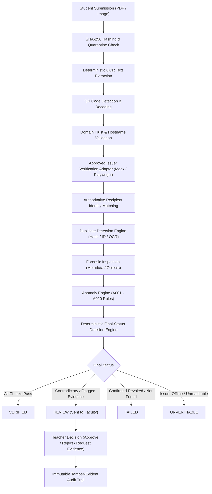

# CertificateGuard: Architecture & Verification Pipeline

CertificateGuard is an evidence-based certificate verification and anomaly detection platform designed for universities, colleges, and credential authorities.

---

## Core Philosophy

> **« AI and automation provide evidence. The issuer and teacher provide trust. »**

The platform operates on a strict verification hierarchy. It never treats AI or automated heuristic detectors as standalone proof of authenticity. 

---

## Verification Trust Hierarchy

1. **Cryptographic Issuer Signature / Key Authority**
2. **Official Authenticated Issuer API**
3. **Official Issuer Verification Web System (via restricted Playwright / Mock adapter)**
4. **Authoritative Certificate ID + Recipient Match**
5. **Cross-Field Semantic Consistency (Course, Issue Date, Expiry)**
6. **Document Forensic Evidence (Metadata, layout, software signatures)**
7. **Duplicate Detection (SHA-256, Perceptual dHash, OCR Jaccard similarity)**
8. **Synthetic Document / AI Detection (Supporting signal only, never proof alone)**
9. **Visual Appearance**

---

## Anomaly Rules Catalog (A001 - A020)

| Rule Code | Title | Severity | Description |
|---|---|---|---|
| **A001** | Certificate ID Missing | HIGH | Unable to detect or extract a unique certificate identifier from document. |
| **A002** | QR Code Missing | MEDIUM | Issuer requires a verifiable QR link, but none was embedded in the document. |
| **A003** | QR Domain Not Trusted | HIGH | QR destination domain does not match the official registered issuer domain. |
| **A004** | QR Redirects to Unexpected Domain | HIGH | QR URL initiates an unapproved redirect to an untrusted domain. |
| **A005** | Issuer Verification Unavailable | MEDIUM | The official issuer verification portal was unreachable or timed out. |
| **A006** | Certificate ID Does Not Exist | CRITICAL | Issuer authoritative records confirm ID does not exist or has been revoked. |
| **A007** | Recipient Differs From Issuer Record | CRITICAL | Issuer verified record recipient differs from certificate document. |
| **A008** | Course or Program Mismatch | HIGH | Issuer records list course differing from certificate text. |
| **A009** | Student Identity Mismatch | HIGH | The submitting student account does not match verified certificate recipient. |
| **A010** | Certificate ID Duplicate | CRITICAL | Certificate ID was previously registered by another student. |
| **A011** | Exact File Duplicate | HIGH | Identical SHA-256 file hash already exists in another submission. |
| **A012** | Perceptual Duplicate | MEDIUM | Visual layout mirrors a prior submission via difference hashing (dHash). |
| **A013** | File Changed After Verification | CRITICAL | Physical document bytes changed on disk post-upload (SHA-256 mismatch). |
| **A014** | Suspicious Forensic Artifacts | MEDIUM | Document created using desktop graphic design software (Photoshop, Canva). |
| **A015** | Synthetic Media Signal Flagged | LOW | Supporting AI artifact detector flagged generative markers. |
| **A016** | Issuer Inconsistent With Extracted | HIGH | Extracted ID differs from issuer returned ID. |
| **A017** | Unusual Certificate ID Format | LOW | Certificate ID does not conform to standard alphanumeric formats. |
| **A018** | Issue Date Inconsistency | MEDIUM | Extracted issue date specifies an implausible future or ancient date. |
| **A019** | Certificate Expired | MEDIUM | Expiration date has lapsed prior to submission. |
| **A020** | Cluster of Similar Submissions | MEDIUM | Textual similarity (>85%) with another student's submission. |
